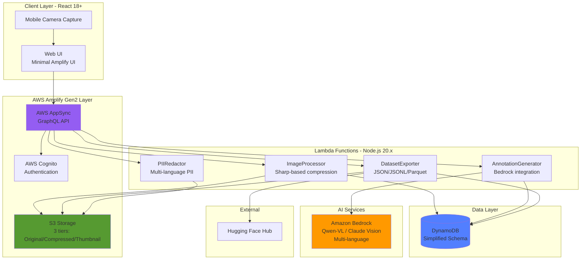

# Design Specification

**Project**: Business OCR Annotator
**Version**: 1.0
**Last Updated**: 2026-01-04

## 1. Architecture Overview

### 1.1 High-Level Architecture



### 1.2 Technology Stack

#### Frontend
- **Framework**: React 18.3+ with TypeScript 5.x
- **UI Library**: **Minimal Amplify UI** (Authenticator only) + Custom React components
- **State Management**: React Context API + React Query for server state
- **Image Annotation**: Custom canvas-based component with touch support
- **Routing**: React Router v6
- **Build Tool**: Vite or AWS Amplify default

#### Backend
- **Infrastructure**: AWS Amplify Gen2
- **Authentication**: AWS Cognito
- **API**: AWS AppSync (GraphQL)
- **Functions**: AWS Lambda (**Node.js 20.x** - latest LTS)
- **Storage**: AWS S3 for images (3-tier storage)
- **Database**: AWS DynamoDB (simplified schema)
- **File Processing**: Lambda + Sharp v0.33+ for image processing

#### AI/ML
- **Vision Models**: **Amazon Bedrock**
  - Qwen-VL (open-weight vision-language model)
  - Claude 3.5 Sonnet (high-accuracy vision)
  - Future model support via Bedrock
- **Model Inference**: Bedrock Runtime API
- **Multi-language**: Native support in Bedrock models

#### External Services
- **Dataset Platform**: Hugging Face Hub API
- **Version Control**: Git for code, Hugging Face for datasets

## 2. Data Models

### 2.1 Database Schema (DynamoDB)

#### Image Table (Simplified)
```typescript
interface Image {
  id: string;                    // Partition Key (UUID)
  datasetId: string;             // Sort Key (GSI)

  // S3 Storage - Store KEYS not URLs for flexibility
  s3KeyOriginal: string;         // Original high-res image (for export)
  s3KeyCompressed: string;       // Model-optimized (≤4MB, for annotation)
  s3KeyThumbnail: string;        // Gallery thumbnail (≤100KB)

  // File metadata
  fileName: string;              // Original filename
  mimeType: string;              // image/jpeg, image/png, image/webp
  originalSize: number;          // Bytes
  compressedSize: number;        // Bytes
  compressionRatio: number;      // For analytics

  // Image dimensions (original)
  width: number;                 // Required for coordinate normalization
  height: number;

  // Document classification
  documentType: DocumentType;    // receipt, invoice, etc.
  language: string;              // ISO 639-1 code (ja, en, zh, ko)

  // Status tracking
  status: ImageStatus;
  processingError?: string;

  // User tracking
  uploadedBy: string;
  uploadedAt: string;

  createdAt: string;
  updatedAt: string;
}

// Note: Presigned URLs generated on-demand via AppSync field resolvers
// This keeps the schema clean and allows bucket migration without DB updates

enum DocumentType {
  RECEIPT = 'RECEIPT',
  INVOICE = 'INVOICE',
  ORDER_FORM = 'ORDER_FORM',
  TAX_FORM = 'TAX_FORM',
  CONTRACT = 'CONTRACT',
  APPLICATION_FORM = 'APPLICATION_FORM',
  OTHER = 'OTHER'
}

enum ImageStatus {
  UPLOADED = 'UPLOADED',
  PROCESSING = 'PROCESSING',
  ANNOTATED = 'ANNOTATED',
  VALIDATED = 'VALIDATED',
  FAILED = 'FAILED'
}
```

#### Annotation Table (Simplified for Cost Efficiency)
```typescript
interface Annotation {
  id: string;                    // Partition Key (UUID)
  imageId: string;               // Sort Key (GSI)
  datasetId: string;             // GSI

  // Core Q&A data
  question: string;
  answer: string;
  language: string;              // ISO 639-1 code (ja, en, zh, ko)

  // Evidence regions (single format - absolute pixels)
  evidenceBoxes: BoundingBox[];  // Visual evidence for answer

  // Classification (for academic compatibility)
  questionType: QuestionType;    // extractive, abstractive, etc.
  answerType: AnswerType;        // span, free_form, yes_no, number

  // Validation
  validationStatus: ValidationStatus;
  validatedBy?: string;
  validatedAt?: string;

  // Generation metadata
  generatedBy: GenerationSource; // AI or Human
  modelVersion?: string;         // Bedrock model ID (e.g., "qwen-vl-max")
  confidence?: number;           // Model confidence (0-1)

  createdAt: string;
  updatedAt: string;
}

// Single bounding box format - stored as absolute pixels
// Converted to normalized coordinates on export
interface BoundingBox {
  x1: number;                    // Top-left x (absolute pixels)
  y1: number;                    // Top-left y (absolute pixels)
  x2: number;                    // Bottom-right x (absolute pixels)
  y2: number;                    // Bottom-right y (absolute pixels)

  // Optional metadata from vision model
  text?: string;                 // Text content in this region
  label?: string;                // Semantic label (e.g., "total_amount", "date")
  confidence?: number;           // Detection confidence (0-1)
}

enum QuestionType {
  EXTRACTIVE = 'EXTRACTIVE',      // Extract text from document
  ABSTRACTIVE = 'ABSTRACTIVE',    // Requires summarization/reasoning
  BOOLEAN = 'BOOLEAN',            // Yes/No questions
  COUNTING = 'COUNTING',          // Count items in document
  REASONING = 'REASONING'         // Multi-step reasoning required
}

enum AnswerType {
  SPAN = 'SPAN',                 // Text span from document
  FREE_FORM = 'FREE_FORM',       // Generated answer
  YES_NO = 'YES_NO',             // Boolean answer
  NUMBER = 'NUMBER'              // Numeric answer
}

enum GenerationSource {
  AI = 'AI',
  HUMAN = 'HUMAN'
}

enum ValidationStatus {
  PENDING = 'PENDING',
  APPROVED = 'APPROVED',
  REJECTED = 'REJECTED',
  FLAGGED = 'FLAGGED'
}

interface AnnotationEdit {
  editedBy: string;              // User ID
  editedAt: string;              // ISO timestamp
  field: string;                 // What was edited
  oldValue: any;
  newValue: any;
}
```

#### Dataset Table
```typescript
interface Dataset {
  id: string;                    // Partition Key (UUID)
  name: string;
  description: string;
  createdBy: string;             // User ID
  createdAt: string;
  updatedAt: string;
  status: DatasetStatus;
  statistics: DatasetStatistics;
  versions: DatasetVersion[];    // Version history
}

enum DatasetStatus {
  ACTIVE = 'ACTIVE',
  ARCHIVED = 'ARCHIVED'
}

interface DatasetStatistics {
  totalImages: number;
  totalAnnotations: number;
  validatedAnnotations: number;
  documentTypeDistribution: Record<DocumentType, number>;
  questionTypeDistribution: Record<QuestionType, number>;
  approvalRate: number;          // Percentage
  lastUpdated: string;
}

interface DatasetVersion {
  version: string;               // Semantic version (1.0.0)
  createdAt: string;
  createdBy: string;
  changelog: string;
  imageCount: number;
  annotationCount: number;
  huggingFaceUrl?: string;       // Published URL
  exportUrls: {
    json?: string;               // S3 URL
    jsonl?: string;
    parquet?: string;
  };
  status: VersionStatus;
}

enum VersionStatus {
  DRAFT = 'DRAFT',
  PUBLISHED = 'PUBLISHED'
}
```

#### User Table
```typescript
interface User {
  id: string;                    // Partition Key (Cognito User ID)
  email: string;
  name: string;
  role: UserRole;
  assignedAnnotations: string[]; // Annotation IDs
  statistics: UserStatistics;
  createdAt: string;
  updatedAt: string;
}

enum UserRole {
  ADMIN = 'ADMIN',
  CURATOR = 'CURATOR',
  ANNOTATOR = 'ANNOTATOR',
  VIEWER = 'VIEWER'
}

interface UserStatistics {
  totalAnnotationsReviewed: number;
  totalApproved: number;
  totalRejected: number;
  averageReviewTime: number;     // Seconds
  accuracy: number;              // Inter-annotator agreement
}
```

### 2.2 GraphQL Schema

```graphql
# Queries
type Query {
  # Images
  getImage(id: ID!): Image
  listImages(datasetId: ID!, filter: ImageFilter, limit: Int, nextToken: String): ImageConnection

  # Annotations
  getAnnotation(id: ID!): Annotation
  listAnnotationsByImage(imageId: ID!): [Annotation]
  listAnnotationsByDataset(datasetId: ID!, filter: AnnotationFilter, limit: Int): AnnotationConnection

  # Datasets
  getDataset(id: ID!): Dataset
  listDatasets(filter: DatasetFilter): [Dataset]
  getDatasetStatistics(datasetId: ID!): DatasetStatistics

  # User
  getCurrentUser: User
  getUserStatistics(userId: ID!): UserStatistics
}

# Mutations
type Mutation {
  # Images
  createImage(input: CreateImageInput!): Image
  updateImage(id: ID!, input: UpdateImageInput!): Image
  deleteImage(id: ID!): DeleteImageResult

  # Annotations
  createAnnotation(input: CreateAnnotationInput!): Annotation
  updateAnnotation(id: ID!, input: UpdateAnnotationInput!): Annotation
  deleteAnnotation(id: ID!): DeleteAnnotationResult
  validateAnnotation(id: ID!, status: ValidationStatus!, reason: String): Annotation

  # AI Generation
  generateAnnotations(imageId: ID!): GenerateAnnotationsResult

  # Datasets
  createDataset(input: CreateDatasetInput!): Dataset
  updateDataset(id: ID!, input: UpdateDatasetInput!): Dataset
  createDatasetVersion(datasetId: ID!, input: CreateVersionInput!): DatasetVersion
  publishToHuggingFace(datasetId: ID!, version: String!): PublishResult

  # Batch operations
  batchValidateAnnotations(input: BatchValidateInput!): BatchValidateResult
}

# Subscriptions
type Subscription {
  onImageProcessed(datasetId: ID!): Image
  onAnnotationCreated(imageId: ID!): Annotation
  onAnnotationValidated(imageId: ID!): Annotation
}

# Types
type Image {
  id: ID!
  datasetId: ID!
  s3Url: String!
  fileName: String!
  documentType: DocumentType!
  status: ImageStatus!
  annotations: [Annotation]
  metadata: ImageMetadata
  createdAt: AWSDateTime!
  updatedAt: AWSDateTime!
}

type Annotation {
  id: ID!
  imageId: ID!
  image: Image
  question: String!
  answer: String!
  questionType: QuestionType!
  boundingBoxes: [BoundingBox!]!
  generatedBy: GenerationSource!
  confidence: Float
  validationStatus: ValidationStatus!
  validatedBy: User
  validatedAt: AWSDateTime
  createdAt: AWSDateTime!
  updatedAt: AWSDateTime!
}

# ... Additional types
```

## 3. Component Design

### 3.1 Frontend Components

#### Component Hierarchy
```
App
├── AuthenticatedApp
│   ├── Navigation
│   ├── Router
│   │   ├── Dashboard
│   │   │   ├── StatisticsCards
│   │   │   ├── DocumentTypeChart
│   │   │   └── RecentActivity
│   │   ├── ImageUpload
│   │   │   ├── FileDropzone
│   │   │   ├── CameraCapture (mobile-specific)
│   │   │   ├── ImagePreview
│   │   │   └── UploadProgress
│   │   ├── ImageGallery
│   │   │   ├── ImageGrid
│   │   │   ├── FilterPanel
│   │   │   └── ImageCard
│   │   ├── AnnotationWorkspace
│   │   │   ├── ImageViewer
│   │   │   │   ├── CanvasAnnotator / TouchAnnotator (responsive)
│   │   │   │   ├── ZoomControls
│   │   │   │   └── ProgressiveImageLoader
│   │   │   ├── QuestionList
│   │   │   │   └── QuestionItem
│   │   │   ├── AnnotationEditor
│   │   │   │   ├── QuestionInput
│   │   │   │   ├── AnswerInput
│   │   │   │   └── BoundingBoxEditor
│   │   │   └── ValidationControls
│   │   ├── DatasetManagement
│   │   │   ├── DatasetList
│   │   │   ├── DatasetDetails
│   │   │   ├── VersionHistory
│   │   │   └── ExportDialog
│   │   └── Settings
│   │       ├── ModelConfiguration
│   │       ├── UserManagement
│   │       └── HuggingFaceSettings
│   └── Notifications
└── UnauthenticatedApp
    ├── Login
    └── SignUp
```

#### Key Component Specifications

##### CanvasAnnotator
```typescript
interface CanvasAnnotatorProps {
  imageUrl: string;
  boundingBoxes: BoundingBox[];
  selectedBoxId?: string;
  onBoundingBoxChange: (boxes: BoundingBox[]) => void;
  onBoundingBoxSelect: (boxId: string) => void;
  mode: 'view' | 'edit';
}

// Features:
// - Render image with overlay canvas
// - Draw bounding boxes with labels
// - Support drag-to-create new boxes
// - Support drag corners/edges to resize
// - Support drag box to move
// - Highlight selected box
// - Zoom and pan controls
```

##### QuestionList
```typescript
interface QuestionListProps {
  annotations: Annotation[];
  selectedAnnotationId?: string;
  onSelectAnnotation: (id: string) => void;
  onValidate: (id: string, status: ValidationStatus) => void;
  onEdit: (id: string) => void;
}

// Features:
// - List all questions for current image
// - Show validation status badges
// - Show confidence scores
// - Filter by status
// - Sort by various criteria
```

##### CameraCapture (Mobile-Specific)
```typescript
interface CameraCaptureProps {
  onCapture: (file: File) => void;
  onCancel: () => void;
  documentType?: DocumentType;
}

// Features:
// - Access device camera via HTML5 capture API
// - Show live camera preview
// - Capture photo on button press
// - Support front/back camera switching
// - Show captured image preview before confirmation
// - Handle camera permissions gracefully
```

##### TouchAnnotator (Mobile-Specific)
```typescript
interface TouchAnnotatorProps {
  imageUrl: string;
  boundingBoxes: BoundingBox[];
  selectedBoxId?: string;
  onBoundingBoxChange: (boxes: BoundingBox[]) => void;
  onBoundingBoxSelect: (boxId: string) => void;
}

// Features:
// - Touch-friendly bounding box manipulation
// - Pinch-to-zoom gesture support
// - Two-finger pan gesture
// - Large touch targets (minimum 44x44px)
// - Corner handles for resizing (minimum 12px touch area)
// - Tap to select box
// - Long-press to show context menu
// - Haptic feedback on interactions (if available)
```

##### ProgressiveImageLoader
```typescript
interface ProgressiveImageLoaderProps {
  thumbnailUrl: string;
  compressedUrl: string;
  originalUrl: string;
  onLoadComplete: () => void;
  showOriginalOption?: boolean;
}

// Features:
// - Load thumbnail first for instant display
// - Load compressed image progressively
// - Option to load original on demand
// - Show loading progress indicator
// - Optimize for mobile network conditions
// - Cache loaded images in browser
// - Handle network errors gracefully
```

### 3.2 Backend Components

#### Lambda Functions

##### ImageProcessor
```typescript
// Trigger: S3 upload event
// Purpose: Process uploaded images and generate multiple versions
async function handler(event: S3Event) {
  // 1. Get original image from S3
  const originalImage = await s3.getObject({ Key: s3KeyOriginal });

  // 2. Extract metadata (dimensions, EXIF)
  const metadata = await sharp(originalImage).metadata();

  // 3. Generate compressed version (≤4MB for model processing)
  const compressed = await compressImage(originalImage, {
    maxSize: 4 * 1024 * 1024,  // 4MB
    maxDimension: 2048,
    quality: 90
  });

  // 4. Generate thumbnail (≤100KB for gallery view)
  const thumbnail = await sharp(originalImage)
    .resize(200, 200, { fit: 'inside' })
    .jpeg({ quality: 80 })
    .toBuffer();

  // 5. Upload compressed and thumbnail to S3
  await Promise.all([
    s3.putObject({ Key: s3KeyCompressed, Body: compressed }),
    s3.putObject({ Key: s3KeyThumbnail, Body: thumbnail })
  ]);

  // 6. Update DynamoDB with all metadata
  await updateImageRecord({
    s3KeyOriginal,
    s3KeyCompressed,
    s3KeyThumbnail,
    originalSize: originalImage.length,
    compressedSize: compressed.length,
    thumbnailSize: thumbnail.length,
    compressionRatio: compressed.length / originalImage.length,
    metadata: {
      original: { width: metadata.width, height: metadata.height },
      compressed: await sharp(compressed).metadata(),
      exif: metadata.exif
    }
  });

  // 7. Trigger annotation generation using compressed image
  await triggerAnnotationGeneration(s3KeyCompressed);

  // 8. Update status to PROCESSING
  await updateImageStatus(imageId, 'PROCESSING');
}

// Helper function for smart compression
async function compressImage(
  buffer: Buffer,
  options: { maxSize: number; maxDimension: number; quality: number }
): Promise<Buffer> {
  const metadata = await sharp(buffer).metadata();

  // Calculate dimensions maintaining aspect ratio
  let { width, height } = metadata;
  if (width > options.maxDimension || height > options.maxDimension) {
    const ratio = Math.min(
      options.maxDimension / width,
      options.maxDimension / height
    );
    width = Math.round(width * ratio);
    height = Math.round(height * ratio);
  }

  // Iteratively compress until under maxSize
  let quality = options.quality;
  let compressed: Buffer;

  do {
    compressed = await sharp(buffer)
      .resize(width, height, { fit: 'inside' })
      .jpeg({ quality, progressive: true })
      .toBuffer();

    if (compressed.length > options.maxSize && quality > 50) {
      quality -= 5;
    } else {
      break;
    }
  } while (quality >= 50);

  return compressed;
}
```

##### AnnotationGenerator
```typescript
// Trigger: Manual invocation or ImageProcessor
// Purpose: Generate AI annotations
async function handler(event: { imageId: string }) {
  // 1. Fetch image from S3
  // 2. Call Qwen model API
  // 3. Parse model response
  // 4. Create annotation records in DynamoDB
  // 5. Update image status to ANNOTATED
  // 6. Publish notification via AppSync subscription
}
```

##### DatasetExporter
```typescript
// Trigger: Manual invocation
// Purpose: Export dataset version
async function handler(event: { datasetId: string, version: string, format: string }) {
  // 1. Fetch all validated annotations
  // 2. Format data (JSON/JSONL/Parquet)
  // 3. Upload to S3
  // 4. Update version record with export URL
  // 5. Optionally publish to Hugging Face
}
```

##### HuggingFacePublisher
```typescript
// Trigger: Manual invocation
// Purpose: Publish dataset to Hugging Face
async function handler(event: { datasetId: string, version: string }) {
  // 1. Fetch dataset export from S3
  // 2. Generate dataset card (README.md)
  // 3. Use Hugging Face API to create/update dataset
  // 4. Upload files to Hugging Face
  // 5. Update version record with HF URL
}
```

##### OCRTokenExtractor
```typescript
// Trigger: ImageProcessor completion or manual invocation
// Purpose: Extract OCR tokens from images
async function handler(event: { imageId: string, s3Key: string }) {
  // 1. Fetch image from S3
  // 2. Call OCR engine (Tesseract or Google Vision)
  // 3. Parse OCR response into OCRToken format
  // 4. Group tokens into words and lines
  // 5. Store tokens in DynamoDB (Image.ocrTokens)
  // 6. Update OCR status to COMPLETED
  // 7. Calculate OCR confidence statistics
}
```

##### PIIRedactor
```typescript
// Trigger: Manual invocation before dataset export
// Purpose: Detect and redact PII in images and annotations
async function handler(event: { imageId: string }) {
  // 1. Fetch image and OCR tokens
  // 2. Run PII detection (regex + ML model)
  // 3. Identify sensitive fields (names, phone, email, address)
  // 4. Generate redacted image with blurred regions
  // 5. Update annotations to remove PII from answer text
  // 6. Store redacted version in S3
  // 7. Flag image as PII-redacted in metadata
}
```

##### ParquetExporter
```typescript
// Trigger: Dataset export request
// Purpose: Convert JSON dataset to Parquet format
async function handler(event: { datasetId: string, version: string }) {
  // 1. Fetch all annotations for dataset version
  // 2. Transform to standardized schema (J-BizDoc format)
  // 3. Normalize bounding boxes to 0-1000 scale
  // 4. Convert to Apache Arrow format
  // 5. Write Parquet file with optimal row group size
  // 6. Upload to S3
  // 7. Generate dataset metadata file
  // 8. Update version record with Parquet URL
}
```

## 4. API Integrations

### 4.1 Qwen Model Integration

```typescript
interface QwenRequest {
  image: string;                 // Base64 encoded or URL
  taskType: 'ocr_annotation';
  parameters: {
    maxQuestions: number;
    questionTypes: QuestionType[];
    language: string;
  };
}

interface QwenResponse {
  annotations: {
    question: string;
    answer: string;
    questionType: string;
    confidence: number;
    boundingBoxes: {
      x: number;
      y: number;
      width: number;
      height: number;
    }[];
  }[];
  processingTime: number;
}

class QwenClient {
  async generateAnnotations(imageUrl: string, config: QwenConfig): Promise<Annotation[]>
  async healthCheck(): Promise<boolean>
}
```

### 4.2 Hugging Face Integration

```typescript
interface HuggingFaceClient {
  // Dataset operations
  createDataset(name: string, config: DatasetConfig): Promise<string>
  uploadFile(datasetId: string, file: Buffer, filename: string): Promise<void>
  createDatasetCard(datasetId: string, metadata: DatasetMetadata): Promise<void>

  // Version operations
  createTag(datasetId: string, tag: string): Promise<void>

  // Dataset info
  getDatasetInfo(datasetId: string): Promise<DatasetInfo>
}

interface DatasetConfig {
  private: boolean;
  license: string;
  tags: string[];
  task_categories: string[];
}

interface DatasetMetadata {
  title: string;
  description: string;
  authors: string[];
  version: string;
  size: number;
  format: string;
  examples: Example[];
}
```

### 4.3 Dataset Export Service

```typescript
interface DatasetExportService {
  // Export formats
  exportToJSON(datasetId: string, version: string, options: ExportOptions): Promise<ExportResult>;
  exportToJSONL(datasetId: string, version: string, options: ExportOptions): Promise<ExportResult>;
  exportToParquet(datasetId: string, version: string, options: ExportOptions): Promise<ExportResult>;

  // Transformation utilities
  transformToStandardFormat(annotations: Annotation[], images: Image[]): StandardDatasetFormat;
  normalizeBoundingBoxes(bbox: number[], imageWidth: number, imageHeight: number, targetScale: number): number[];
  generateDatasetCard(metadata: DatasetCardMetadata): string;
}

interface ExportOptions {
  includeOCRTokens: boolean;
  normalizationScale: 1 | 1000;  // 0-1 or 0-1000
  includePII: boolean;           // Whether to include PII or use redacted version
  coordinateFormat: 'absolute' | 'normalized_1' | 'normalized_1000' | 'all';
}

interface ExportResult {
  s3Url: string;
  format: 'json' | 'jsonl' | 'parquet';
  size: number;
  recordCount: number;
  checksum: string;
  compressionRatio?: number;
}

interface StandardDatasetFormat {
  dataset_version: string;
  dataset_metadata: {
    name: string;
    description: string;
    language: string;
    license: string;
    citation: string;
    created_at: string;
    version: string;
    size_bytes: number;
    num_examples: number;
  };
  data: StandardExample[];
}

interface StandardExample {
  question_id: string;
  image_id: string;
  image_url: string;
  image_metadata: ImageMetadata;
  document_metadata: DocumentMetadata;
  qa_pairs: QAPair[];
  ocr_tokens: OCRToken[];
  annotation_metadata: AnnotationMetadata;
}

interface QAPair {
  question: string;
  answer: string;
  question_type: string;
  evidence_segments: EvidenceSegment[];
  answer_type: string;
  difficulty: string;
  requires_reasoning: boolean;
}

interface DatasetCardMetadata {
  name: string;
  description: string;
  homepage: string;
  license: string;
  citation: string;
  language: string;
  task_categories: string[];
  size_categories: string[];
  tags: string[];
  authors: string[];
  version: string;
  legal_notice?: string; // Japanese Copyright Act info
}
```

### 4.4 OCR Engine Integration

```typescript
interface OCREngine {
  extractTokens(imageBuffer: Buffer, language: string): Promise<OCRResult>;
  getSupportedLanguages(): string[];
  healthCheck(): Promise<boolean>;
}

interface OCRResult {
  tokens: OCRToken[];
  confidence: number;         // Overall confidence
  processingTime: number;     // Milliseconds
  engine: string;             // e.g., "tesseract-5.3.0-jpn"
  warnings?: string[];        // Processing warnings
}

// Tesseract implementation
class TesseractOCREngine implements OCREngine {
  async extractTokens(imageBuffer: Buffer, language: string): Promise<OCRResult>
  getSupportedLanguages(): string[]
  healthCheck(): Promise<boolean>
}

// Google Vision API implementation (optional, premium)
class GoogleVisionOCREngine implements OCREngine {
  async extractTokens(imageBuffer: Buffer, language: string): Promise<OCRResult>
  getSupportedLanguages(): string[]
  healthCheck(): Promise<boolean>
}
```

### 4.5 PII Detection Service

```typescript
interface PIIDetectionService {
  detectPII(text: string, language: string): Promise<PIIDetection[]>;
  redactImage(imageBuffer: Buffer, regions: PIIRegion[]): Promise<Buffer>;
  redactText(text: string, detections: PIIDetection[]): string;
}

interface PIIDetection {
  type: 'name' | 'email' | 'phone' | 'address' | 'id_number';
  text: string;
  startIndex: number;
  endIndex: number;
  confidence: number;
  bbox?: [number, number, number, number]; // If associated with OCR token
}

interface PIIRegion {
  bbox: [number, number, number, number];
  type: string;
}

class PIIDetector implements PIIDetectionService {
  // Regex patterns for Japanese phone numbers, emails, etc.
  private patterns: Record<string, RegExp>;

  async detectPII(text: string, language: string): Promise<PIIDetection[]>
  async redactImage(imageBuffer: Buffer, regions: PIIRegion[]): Promise<Buffer>
  redactText(text: string, detections: PIIDetection[]): string
}
```

## 5. Security Design

### 5.1 Authentication & Authorization

```typescript
// Cognito User Pools for authentication
// IAM policies for service-to-service auth
// API Gateway/AppSync for request authentication

// Role-based access control
const permissions = {
  ADMIN: ['*'],
  CURATOR: [
    'image:*',
    'annotation:*',
    'dataset:*',
    'user:read'
  ],
  ANNOTATOR: [
    'image:read',
    'annotation:create',
    'annotation:update',
    'annotation:validate'
  ],
  VIEWER: [
    'image:read',
    'annotation:read',
    'dataset:read'
  ]
};

// GraphQL resolver authorization
function checkPermission(user: User, resource: string, action: string): boolean {
  const requiredPermission = `${resource}:${action}`;
  const userPermissions = permissions[user.role];
  return userPermissions.includes('*') ||
         userPermissions.includes(requiredPermission) ||
         userPermissions.includes(`${resource}:*`);
}
```

### 5.2 Data Protection

- S3 bucket encryption at rest (AES-256)
- HTTPS for all data in transit
- Presigned URLs with expiration for image access
- DynamoDB encryption at rest
- Secrets Manager for API keys and credentials

## 6. Performance Optimization

### 6.1 Caching Strategy

```typescript
// CloudFront for static assets
// AppSync query caching for dashboard statistics
// DynamoDB DAX for hot data
// Browser caching for images with ETag

const cacheConfig = {
  images: {
    ttl: 86400,              // 24 hours
    storage: 'cloudfront'
  },
  statistics: {
    ttl: 300,                // 5 minutes
    storage: 'appsync'
  },
  annotations: {
    ttl: 60,                 // 1 minute
    storage: 'browser'
  }
};
```

### 6.2 Image Processing

```typescript
// Generate multiple sizes for responsive display
const imageSizes = {
  thumbnail: { width: 200, height: 200 },
  medium: { width: 800, height: 600 },
  large: { width: 1600, height: 1200 },
  original: { preserveOriginal: true }
};

// Lazy loading with Intersection Observer
// Progressive JPEG encoding
// WebP format with fallback
```

## 7. Error Handling

### 7.1 Error Types

```typescript
enum ErrorCode {
  // Client errors (4xx)
  INVALID_INPUT = 'INVALID_INPUT',
  UNAUTHORIZED = 'UNAUTHORIZED',
  FORBIDDEN = 'FORBIDDEN',
  NOT_FOUND = 'NOT_FOUND',
  CONFLICT = 'CONFLICT',

  // Server errors (5xx)
  INTERNAL_ERROR = 'INTERNAL_ERROR',
  SERVICE_UNAVAILABLE = 'SERVICE_UNAVAILABLE',
  MODEL_API_ERROR = 'MODEL_API_ERROR',
  STORAGE_ERROR = 'STORAGE_ERROR'
}

interface AppError {
  code: ErrorCode;
  message: string;
  details?: Record<string, any>;
  retryable: boolean;
}
```

### 7.2 Retry Logic

```typescript
async function withRetry<T>(
  fn: () => Promise<T>,
  maxRetries: number = 3,
  backoff: number = 1000
): Promise<T> {
  for (let i = 0; i < maxRetries; i++) {
    try {
      return await fn();
    } catch (error) {
      if (i === maxRetries - 1 || !isRetryable(error)) {
        throw error;
      }
      await sleep(backoff * Math.pow(2, i));
    }
  }
  throw new Error('Max retries exceeded');
}
```

## 8. Monitoring & Logging

### 8.1 Metrics

```typescript
// CloudWatch metrics to track
const metrics = [
  'ImageUploadCount',
  'AnnotationGenerationCount',
  'AnnotationValidationCount',
  'ModelAPILatency',
  'ModelAPIErrors',
  'DatasetExportCount',
  'UserActiveCount'
];

// CloudWatch alarms
const alarms = [
  { metric: 'ModelAPIErrors', threshold: 10, period: 300 },
  { metric: 'ModelAPILatency', threshold: 30000, period: 300 },
  { metric: 'LambdaErrors', threshold: 5, period: 60 }
];
```

### 8.2 Logging

```typescript
// Structured logging with context
interface LogContext {
  requestId: string;
  userId?: string;
  imageId?: string;
  annotationId?: string;
  operation: string;
}

class Logger {
  info(message: string, context: LogContext): void
  warn(message: string, context: LogContext): void
  error(message: string, error: Error, context: LogContext): void
}
```

## 9. Deployment Architecture

### 9.1 Environments

- **Development**: Local + AWS dev account
- **Staging**: AWS staging account with production-like config
- **Production**: AWS production account with high availability

### 9.2 CI/CD Pipeline

```yaml
# GitHub Actions / AWS Amplify CI/CD
stages:
  - lint
  - test
  - build
  - deploy

# Automated testing
tests:
  - unit_tests
  - integration_tests
  - e2e_tests

# Deployment strategy
deployment:
  type: rolling
  canary: 10%           # Route 10% traffic to new version first
  monitor_period: 5min   # Monitor before full rollout
```

## 10. Future Considerations

### 10.1 Scalability Enhancements
- Implement batch processing for large datasets
- Add caching layer for frequently accessed data
- Consider migrating to Aurora for complex queries
- Implement dataset partitioning for >100k images

### 10.2 Feature Enhancements
- Real-time collaboration on annotations
- Custom model training pipeline
- Advanced analytics and ML insights
- Mobile application support
- Webhook integrations

---

**Document Status**: Initial Draft
**Next Review Date**: TBD
**Approval Status**: Pending Review
