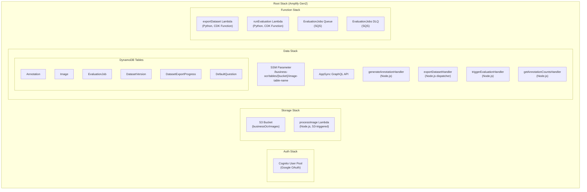
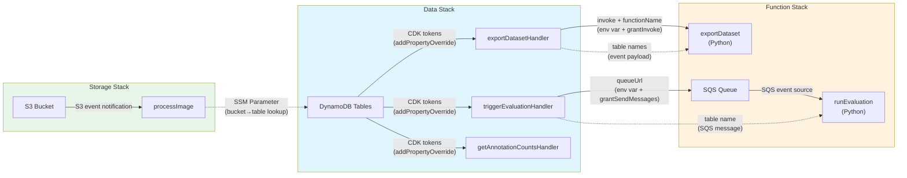
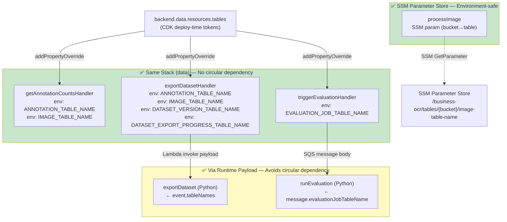
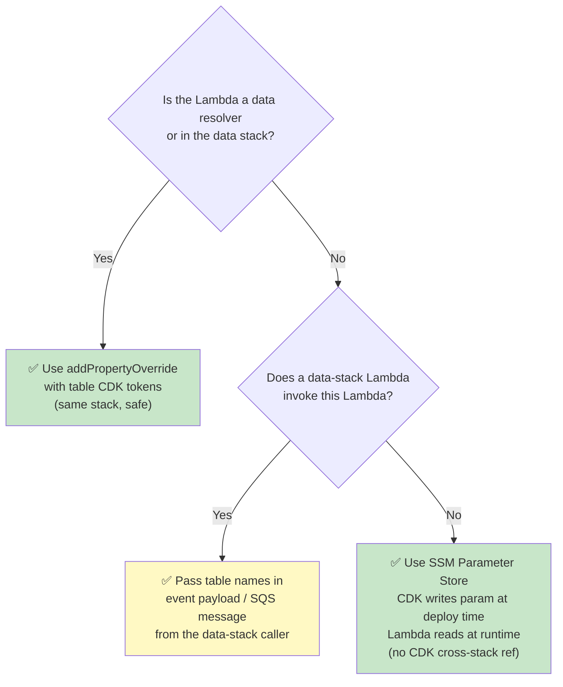

# CloudFormation Stack Dependency Overview

This document visualizes the Amplify Gen2 nested stack architecture and cross-stack dependencies.
Keeping this up-to-date helps avoid circular dependency errors when modifying `backend.ts` or `resource.ts`.

## Stack Overview



## Cross-Stack Dependencies



## How Table Names Reach Each Lambda



## Rules to Avoid Circular Dependencies

### The Fundamental Constraint

```
If DATA stack references FUNCTION stack (e.g., data resolvers invoke Lambdas),
then FUNCTION stack MUST NOT reference DATA stack (e.g., table CDK tokens).
```

### Decision Tree for Passing Table Names



### Checklist When Adding New Lambdas

1. **Data resolver functions** (referenced in `a.handler.function(...)` in schema):
   - Add `resourceGroupName: 'data'` to `defineFunction` options
   - Can use `addPropertyOverride` with `backend.data.resources.tables` tokens
   - Can use `table.tableArn` in IAM policies

2. **Function-stack Lambdas** invoked by data-stack dispatchers:
   - **DO NOT** use `addEnvironment` or `addPropertyOverride` with table CDK tokens
   - **DO** receive table names via event payload or SQS message from the data-stack caller
   - **DO** use wildcard ARN strings for IAM policies (`'arn:aws:dynamodb:*:*:table/MyTable-*'`)

3. **Function-stack Lambdas** with no data-stack intermediary (e.g., S3-triggered):
   - Cannot use CDK table tokens at all
   - Use SSM Parameter Store: CDK writes the parameter (in the data stack where both
     the bucket token and table token are available), Lambda reads it at runtime
   - See `processImage` for the reference implementation

### What Creates Cross-Stack References

| Pattern | Creates cross-stack ref? |
|---------|--------------------------|
| `table.tableName` in `addPropertyOverride` | **Yes** — CDK token resolves to `Fn::GetAtt` across stacks |
| `table.tableArn` in IAM policy `resources` | **Yes** — same mechanism |
| `lambda.addEnvironment('KEY', table.tableName)` | **Yes** — same mechanism |
| `'arn:aws:dynamodb:*:*:table/Prefix-*'` string in IAM | **No** — plain string, no token |
| Passing table name in Lambda invoke payload at runtime | **No** — runtime data flow, invisible to CDK |
| SSM Parameter (CDK writes in data stack, Lambda reads at runtime) | **No** — parameter created in same stack as table; Lambda only reads at runtime |

---

**Last Updated**: 2026-01-31
