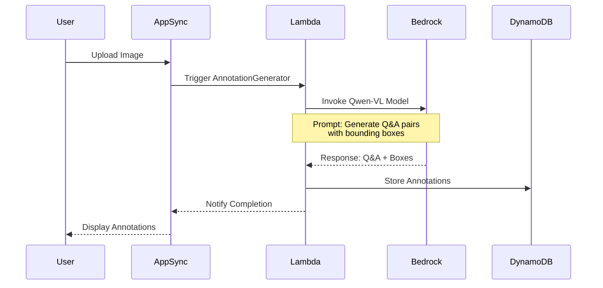

# Proposal: Standardize Dataset Format for Academic Compatibility (Revised)

**Date**: 2026-01-04 (Revised)
**Author**: Claude Agent
**Status**: Proposed
**Version**: 2.0
**Supersedes**: 20260104_standardize_dataset_format.md

## Revision Summary

This revision incorporates architectural feedback:
- ✅ Use Amazon Bedrock for model inference (supports Qwen and other OSS models)
- ✅ No OCR extraction - rely on vision models for annotation
- ✅ Simplified metadata (removed containsSeal, scriptTypes, yearRange)
- ✅ Unified bounding box approach (single format, not duplicate)
- ✅ Simplified annotation table to minimize costs
- ✅ Multi-language support (not just Japanese)
- ✅ Latest Node.js (20.x) and React (18+) for Lambda
- ✅ Minimal Amplify UI dependency
- ✅ Mermaid diagrams for architecture

## 1. Background

The Business OCR Annotator needs a standardized dataset format that:
1. Aligns with academic research standards (DocVQA, LayoutLM)
2. Supports multiple languages (Japanese, English, etc.)
3. Provides visual grounding for explainability
4. Optimizes for cost-effective annotation
5. Enables efficient Hugging Face streaming

## 2. Architecture Overview

```mermaid
graph TB
    subgraph "Client Layer"
        UI[React 18+ UI<br/>Minimal Amplify UI]
        Camera[Mobile Camera Capture]
    end

    subgraph "AWS Amplify Gen2"
        Cognito[AWS Cognito<br/>Authentication]
        AppSync[AWS AppSync<br/>GraphQL API]
        S3[S3 Storage<br/>Images: Original, Compressed, Thumbnail]
    end

    subgraph "Lambda Functions (Node.js 20.x)"
        ImageProc[ImageProcessor<br/>Compression & Thumbnails]
        AnnotGen[AnnotationGenerator<br/>Vision Model via Bedrock]
        DatasetExp[DatasetExporter<br/>JSON/JSONL/Parquet]
        PIIRedact[PIIRedactor<br/>Privacy Protection]
    end

    subgraph "Data Layer"
        DynamoDB[(DynamoDB<br/>Image, Annotation, Dataset)]
    end

    subgraph "AI Services"
        Bedrock[Amazon Bedrock<br/>Qwen-VL / Claude Vision<br/>Multi-language Support]
    end

    subgraph "External"
        HF[Hugging Face Hub<br/>Dataset Publishing]
    end

    UI --> AppSync
    Camera --> UI
    AppSync --> Lambda Functions
    ImageProc --> S3
    ImageProc --> DynamoDB
    AnnotGen --> Bedrock
    AnnotGen --> DynamoDB
    DatasetExp --> S3
    DatasetExp --> HF
    PIIRedact --> S3

    style Bedrock fill:#ff9900
    style DynamoDB fill:#527FFF
    style S3 fill:#569A31
```

## 3. Simplified Data Model

### 3.1 Core Principle: Cost-Effective Annotation

To minimize annotation costs, we:
- Store only essential fields in DynamoDB
- Use single bounding box format (no duplication)
- Generate normalized coordinates on export (not storage)
- Defer metadata enrichment to export time

### 3.2 Image Table (Simplified)

```typescript
interface Image {
  id: string;                    // Partition Key
  datasetId: string;             // Sort Key (GSI)

  // S3 Storage - Store keys separately for flexibility
  s3KeyOriginal: string;         // Original high-res image
  s3KeyCompressed: string;       // Model-optimized (≤4MB)
  s3KeyThumbnail: string;        // Gallery thumbnail (≤100KB)

  // Image metadata
  fileName: string;
  mimeType: string;
  width: number;                 // Original dimensions
  height: number;
  originalSize: number;          // Bytes
  compressedSize: number;

  // Document classification
  documentType: DocumentType;    // receipt, invoice, etc.
  language: string;              // ISO 639-1 code (ja, en, zh, ko)

  // Processing status
  status: ImageStatus;
  uploadedBy: string;
  uploadedAt: string;

  createdAt: string;
  updatedAt: string;
}

enum DocumentType {
  RECEIPT = 'RECEIPT',
  INVOICE = 'INVOICE',
  ORDER_FORM = 'ORDER_FORM',
  TAX_FORM = 'TAX_FORM',
  CONTRACT = 'CONTRACT',
  APPLICATION_FORM = 'APPLICATION_FORM',
  OTHER = 'OTHER'
}

enum ImageStatus {
  UPLOADED = 'UPLOADED',
  PROCESSING = 'PROCESSING',
  ANNOTATED = 'ANNOTATED',
  VALIDATED = 'VALIDATED',
  FAILED = 'FAILED'
}
```

**Design Decision: Separate S3 Keys**
- Store keys separately (not full URLs) for flexibility
- Generate presigned URLs on-demand via AppSync resolvers
- Allows bucket migration without DB updates
- Reduces storage costs (keys are shorter than full URLs)

### 3.3 Annotation Table (Simplified)

```typescript
interface Annotation {
  id: string;                    // Partition Key
  imageId: string;               // Sort Key (GSI)
  datasetId: string;             // GSI

  // Core Q&A data
  question: string;
  answer: string;
  language: string;              // ISO 639-1 code

  // Evidence (single format - absolute pixels)
  evidenceBoxes: BoundingBox[];  // Array of evidence regions

  // Classification (for academic compatibility)
  questionType: QuestionType;    // extractive, abstractive, etc.
  answerType: AnswerType;        // span, free_form, yes_no, number

  // Validation
  validationStatus: ValidationStatus;
  validatedBy?: string;
  validatedAt?: string;

  // Metadata
  generatedBy: GenerationSource; // AI or Human
  modelVersion?: string;         // Bedrock model ID
  confidence?: number;           // Model confidence

  createdAt: string;
  updatedAt: string;
}

interface BoundingBox {
  // Store absolute pixel coordinates (single source of truth)
  x1: number;                    // Top-left x
  y1: number;                    // Top-left y
  x2: number;                    // Bottom-right x
  y2: number;                    // Bottom-right y

  // Optional metadata
  text?: string;                 // Text in this region (from vision model)
  label?: string;                // Semantic label (e.g., "total_amount")
  confidence?: number;           // Detection confidence
}

enum QuestionType {
  EXTRACTIVE = 'EXTRACTIVE',      // Extract text from document
  ABSTRACTIVE = 'ABSTRACTIVE',    // Requires summarization
  BOOLEAN = 'BOOLEAN',            // Yes/No questions
  COUNTING = 'COUNTING',          // Count items
  REASONING = 'REASONING'         // Multi-step reasoning
}

enum AnswerType {
  SPAN = 'SPAN',                 // Text span from document
  FREE_FORM = 'FREE_FORM',       // Generated answer
  YES_NO = 'YES_NO',             // Boolean
  NUMBER = 'NUMBER'              // Numeric
}

enum ValidationStatus {
  PENDING = 'PENDING',
  APPROVED = 'APPROVED',
  REJECTED = 'REJECTED',
  FLAGGED = 'FLAGGED'
}

enum GenerationSource {
  AI = 'AI',
  HUMAN = 'HUMAN'
}
```

**Design Decisions:**
1. **Single Bounding Box Format**: Store absolute pixels only, convert to normalized on export
2. **No OCR Tokens**: Vision models handle text extraction implicitly
3. **Language Field**: Support multi-language at annotation level
4. **Minimal Metadata**: Only essential fields to reduce costs

## 4. Amazon Bedrock Integration

### 4.1 Architecture



### 4.2 Supported Models

Amazon Bedrock provides access to:
- **Qwen-VL**: Open-source vision-language model
- **Claude 3.5 Sonnet**: High-accuracy vision model
- **Future models**: Easy to add new models

### 4.3 Implementation

```typescript
// Bedrock client for vision models
interface BedrockVisionClient {
  generateAnnotations(
    imageS3Url: string,
    language: string,
    options: GenerationOptions
  ): Promise<AnnotationResult>;
}

interface GenerationOptions {
  modelId: string;               // e.g., "qwen-vl-max", "anthropic.claude-3-5-sonnet"
  maxQuestions: number;
  questionTypes: QuestionType[];
  temperature: number;
  maxTokens: number;
}

interface AnnotationResult {
  annotations: {
    question: string;
    answer: string;
    questionType: QuestionType;
    answerType: AnswerType;
    evidenceBoxes: BoundingBox[];
    confidence: number;
  }[];
  modelVersion: string;
  processingTime: number;
}
```

## 5. Export Format Strategy

### 5.1 Coordinate Transformation

```typescript
// Export-time transformation (not stored in DB)
function transformForExport(
  annotation: Annotation,
  image: Image,
  targetFormat: 'absolute' | 'normalized_1' | 'normalized_1000'
): ExportAnnotation {
  return {
    ...annotation,
    evidenceBoxes: annotation.evidenceBoxes.map(box =>
      normalizeBox(box, image.width, image.height, targetFormat)
    )
  };
}

function normalizeBox(
  box: BoundingBox,
  imageWidth: number,
  imageHeight: number,
  format: string
): BoundingBox {
  if (format === 'absolute') {
    return box; // No transformation
  }

  const scale = format === 'normalized_1000' ? 1000 : 1;

  return {
    x1: Math.round((box.x1 / imageWidth) * scale),
    y1: Math.round((box.y1 / imageHeight) * scale),
    x2: Math.round((box.x2 / imageWidth) * scale),
    y2: Math.round((box.y2 / imageHeight) * scale),
    text: box.text,
    label: box.label,
    confidence: box.confidence
  };
}
```

### 5.2 Export Schema (J-BizDoc Compatible)

```json
{
  "dataset_version": "1.0",
  "dataset_metadata": {
    "name": "business-document-vqa",
    "description": "Multi-language visual QA for business documents",
    "languages": ["ja", "en", "zh", "ko"],
    "license": "CC-BY-SA-4.0",
    "created_at": "2026-01-04T00:00:00Z"
  },
  "data": [
    {
      "question_id": "uuid",
      "image_id": "uuid",
      "image_url": "s3://bucket/path/image.webp",
      "language": "ja",
      "document_type": "receipt",
      "qa_pair": {
        "question": "合計金額はいくらですか？",
        "answer": "¥12,580",
        "question_type": "extractive",
        "answer_type": "span",
        "evidence_boxes": [
          {
            "box": [710, 731, 873, 780],
            "format": "xyxy_normalized_1000",
            "text": "合計 ¥12,580",
            "label": "total_amount",
            "confidence": 0.98
          }
        ]
      },
      "metadata": {
        "generated_by": "bedrock:qwen-vl-max",
        "validation_status": "approved",
        "validated_at": "2026-01-04T12:00:00Z"
      }
    }
  ]
}
```

### 5.3 Multi-Language Support

```typescript
interface LanguageConfig {
  code: string;                  // ISO 639-1 (ja, en, zh, ko)
  name: string;                  // Display name
  bedrockPrompt: string;         // Language-specific prompt template
  supportedModels: string[];     // Compatible Bedrock models
}

const SUPPORTED_LANGUAGES: LanguageConfig[] = [
  {
    code: 'ja',
    name: 'Japanese',
    bedrockPrompt: 'この画像から質問と回答のペアを生成してください。',
    supportedModels: ['qwen-vl-max', 'claude-3-5-sonnet']
  },
  {
    code: 'en',
    name: 'English',
    bedrockPrompt: 'Generate question-answer pairs from this image.',
    supportedModels: ['qwen-vl-max', 'claude-3-5-sonnet']
  },
  {
    code: 'zh',
    name: 'Chinese',
    bedrockPrompt: '从这张图片生成问答对。',
    supportedModels: ['qwen-vl-max', 'claude-3-5-sonnet']
  },
  {
    code: 'ko',
    name: 'Korean',
    bedrockPrompt: '이 이미지에서 질문-답변 쌍을 생성하세요.',
    supportedModels: ['qwen-vl-max', 'claude-3-5-sonnet']
  }
];
```

## 6. Technology Stack Updates

### 6.1 Runtime Versions

- **Node.js**: 20.x (AWS Lambda latest)
- **React**: 18.3+ with TypeScript 5.x
- **Amplify Gen2**: Latest
- **Amplify UI**: Minimal usage (only Authenticator)

### 6.2 Key Dependencies

```json
{
  "frontend": {
    "react": "^18.3.0",
    "react-dom": "^18.3.0",
    "typescript": "^5.0.0",
    "@aws-amplify/ui-react": "^6.0.0",
    "aws-amplify": "^6.0.0",
    "react-router-dom": "^6.0.0"
  },
  "backend": {
    "@aws-sdk/client-bedrock-runtime": "^3.0.0",
    "@aws-sdk/client-s3": "^3.0.0",
    "@aws-sdk/client-dynamodb": "^3.0.0",
    "sharp": "^0.33.0",
    "apache-arrow": "^14.0.0"
  }
}
```

## 7. Impact on Requirements

### 7.1 Removed Requirements

- ~~REQ-QG-006~~: OCR token extraction (not needed)
- ~~REQ-NF-C-004~~: Japanese Copyright Act (generalized to multi-language)
- ~~REQ-DC-004~~: Japanese-specific metadata fields

### 7.2 Updated Requirements

- **REQ-QG-001**: Update to use Amazon Bedrock instead of external Qwen API
- **REQ-MC-001**: Change "OCR model endpoints" to "Bedrock model selection"
- **REQ-EF-004**: Remove "OCR tokens", keep "Evidence boxes with text"
- **NEW REQ-ML-001**: System shall support multiple languages (ja, en, zh, ko)
- **NEW REQ-ML-002**: Users shall specify document language on upload
- **NEW REQ-ML-003**: System shall generate annotations in the document's language
- **NEW REQ-BR-001**: System shall use Amazon Bedrock for vision model inference
- **NEW REQ-BR-002**: System shall support multiple Bedrock models (Qwen-VL, Claude Vision)

### 7.3 Added Requirements

- **REQ-S3-001**: System shall store S3 keys separately from URLs in database
- **REQ-S3-002**: System shall generate presigned URLs on-demand with configurable expiration
- **REQ-BB-001**: System shall store bounding boxes in absolute pixel coordinates
- **REQ-BB-002**: System shall transform coordinates to normalized format on export

## 8. Simplified Implementation Plan

### Phase 1: Core Infrastructure (Week 1-2)
1. Set up DynamoDB with simplified schema
2. Configure S3 with presigned URL generation
3. Set up Amazon Bedrock access
4. Implement ImageProcessor Lambda (Node 20.x)

### Phase 2: Bedrock Integration (Week 2-3)
1. Create BedrockVisionClient service
2. Implement AnnotationGenerator Lambda
3. Add multi-language prompt templates
4. Test with Qwen-VL and Claude Vision

### Phase 3: Frontend (Week 3-4)
1. React 18 setup with minimal Amplify UI
2. Language selection on upload
3. Annotation workspace with bounding box editor
4. Multi-language UI support

### Phase 4: Export Pipeline (Week 4-5)
1. Coordinate normalization utilities
2. Parquet export with Apache Arrow
3. Dataset card generation
4. Hugging Face integration

### Phase 5: PII & Testing (Week 5-6)
1. Language-aware PII detection
2. Comprehensive testing
3. Documentation
4. Deployment

## 9. Open Questions & Decisions

### Q1: S3 URL vs Key Storage
**Decision**: Store keys separately
- **Pros**: Flexibility, cost savings, easier bucket migration
- **Cons**: Requires URL generation logic
- **Recommendation**: Use AppSync field resolvers to generate URLs

### Q2: Bounding Box vs Evidence Segment
**Decision**: Single format called `evidenceBoxes`
- They are essentially the same concept
- Storing twice would increase costs unnecessarily
- Transform to different formats on export only

### Q3: OCR vs Vision Models
**Decision**: No OCR needed
- Modern vision models (Qwen-VL, Claude) handle text extraction
- No need for separate OCR pipeline
- Reduces complexity and cost

### Q4: Language Strategy
**Decision**: Store language at annotation level
- Allows mixed-language datasets
- More flexible than dataset-level language
- Required field for all annotations

## 10. Success Metrics

1. **Cost Efficiency**: Annotation storage cost <$0.01 per 1000 annotations
2. **Model Flexibility**: Support 2+ Bedrock models
3. **Multi-language**: Support 4+ languages at launch
4. **Export Compatibility**: 100% compatible with LayoutLM format
5. **Performance**: Annotation generation <30s per image

## 11. Next Steps

1. ✅ Review and approve this revised proposal
2. Update requirements.md with Bedrock and multi-language
3. Update design.md with simplified data models
4. Update tasks.md to remove OCR, add Bedrock
5. Create proof-of-concept Bedrock integration
6. Validate export format with sample data

---

**References**:
- Amazon Bedrock Documentation: https://docs.aws.amazon.com/bedrock/
- AWS Lambda Node.js 20.x Runtime: https://docs.aws.amazon.com/lambda/latest/dg/lambda-nodejs.html
- DocVQA Dataset: Mathew et al., ICDAR 2021
- LayoutLM: Xu et al., KDD 2020
